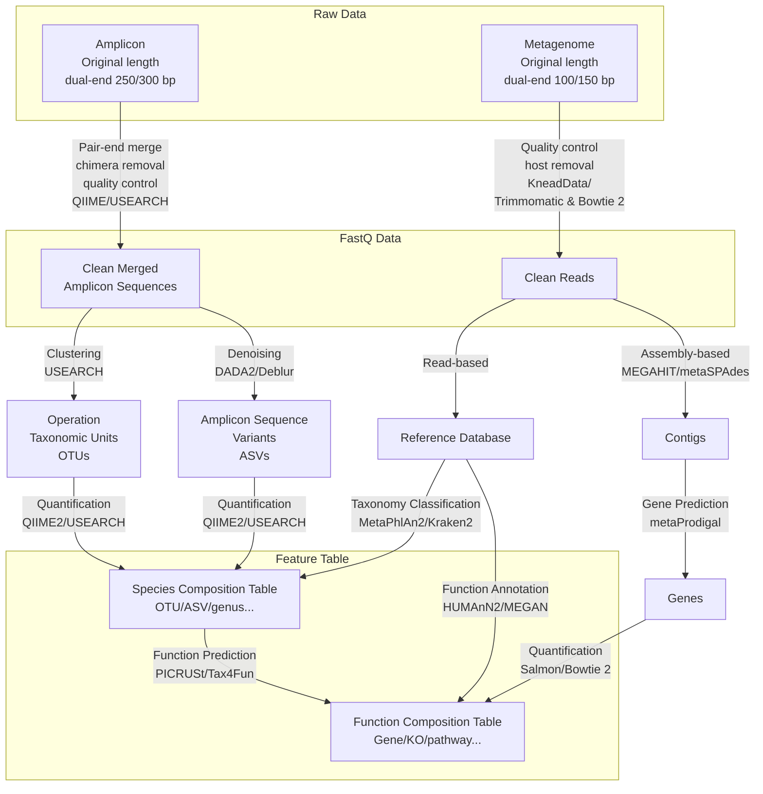

# Tentative Analysis Plan

```mermaid
flowchart TD
    subgraph Raw[Raw Data]
        A1[Amplicon\n Original length\n dual-end 250/300 bp]
        A2[Metagenome\n Original length\n dual-end 100/150 bp]
    end

    subgraph FastQ[FastQ Data]
        B1[Clean Merged\n Amplicon Sequences]
        B2[Clean Reads]
    end

    subgraph Feature[Feature Table]
        C1[Species Composition Table\n OTU/ASV/genus...]
        C2[Function Composition Table\n Gene/KO/pathway...]
    end

    A1 -->|Pair-end merge\n chimera removal\n quality control\n QIIME/USEARCH| B1
    A2 -->|Quality control\n host removal\n KneadData/\n Trimmomatic & Bowtie 2| B2

    B1 -->|Clustering\n USEARCH| D1[Operation\n Taxonomic Units\n OTUs]
    B1 -->|Denoising\n DADA2/Deblur| D2[Amplicon Sequence\n Variants\n ASVs]

    B2 -->|Read-based| E1[Reference Database]
    B2 -->|Assembly-based\n MEGAHIT/metaSPAdes| E2[Contigs]

    D1 & D2 -->|Quantification\n QIIME2/USEARCH| C1

    E1 -->|Taxonomy Classification\n MetaPhlAn2/Kraken2| C1
    E1 -->|Function Annotation\n HUMAnN2/MEGAN| C2

    E2 -->|Gene Prediction\n metaProdigal| F1[Genes]
    F1 -->|Quantification\n Salmon/Bowtie 2| C2

    C1 -->|Function Prediction\n PICRUSt/Tax4Fun| C2
```

Since Lina will provide WGS dataset for us to play around, we could

1, Perform function prediction on the ASV and compare with WGS result
2. TODO: More ideas
